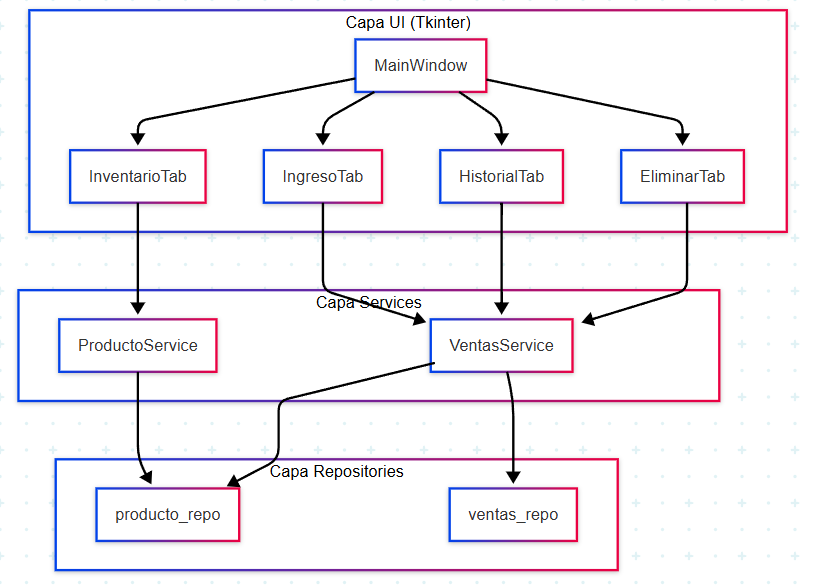
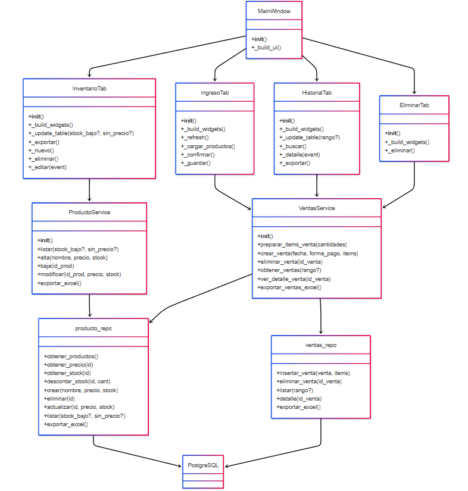

# Arquitectura

Matex AdminDB está organizada en **4 capas** bien separadas:

## Diagrama de capas (Mermaid)


- UI (presentación): <br>
Tkinter muestra pestañas y cuadros de diálogo; no contiene lógica de BD.
- Services (negocio): <br>
Validan reglas simples (stock disponible, totales con IVA) y orquestan varias llamadas a repos.
- Repositories (persistencia): <br>
Sentencias SQL directas usando psycopg2; sin reglas de negocio.
- PostgreSQL: <br>
Esquema en db/schema.sql (ver más abajo).

---

## Diagrama simplificado de clases con Mermaid


---

## Flujos de datos
| Paso | Acción | Origen → Destino |
|------|--------|------------------|
| **1** | Usuario ingresa venta y pulsa *Confirmar* | `IngresoTab` → `VentasService.preparar_items_venta()` |
| **2** | Service valida stock y calcula IVA | `VentasService` |
| **3** | Usuario pulsa *Guardar venta* | `VentasService.crear_venta()` → `ventas_repo.insertar_venta()` + `producto_repo.descontar_stock()` |
| **4** | BD actualiza tablas `ventas`, `ventas_producto`, `productos` | Repositorios → PostgreSQL |
| **5** | UI refresca tablas | `IngresoTab` llama a `InventarioTab._update_table()` |

---

## Módulos y responsabilidades
| Módulo | Descripción | Tests (fase 3) |
|--------|-------------|----------------|
| `ui/` | Componentes Tkinter; sin SQL | Tests de integración con `pytest-qt` |
| `services/producto_service.py` | Reglas de stock y exportación | Unit tests con mocks |
| `services/ventas_service.py` | Transacciones de ventas; maneja stock y calculo de totales | Unit + integration |
| `repository/*_repo.py` | CRUD SQL puro | Tests con DB en contenedor |
| `repository/db.py` | Pool de conexiones (psycopg2) | Mock/stub en unit tests |

---

## Esquema de base de datos
```text
db/schema.sql
```
> El script idempotente se mantiene ahi
