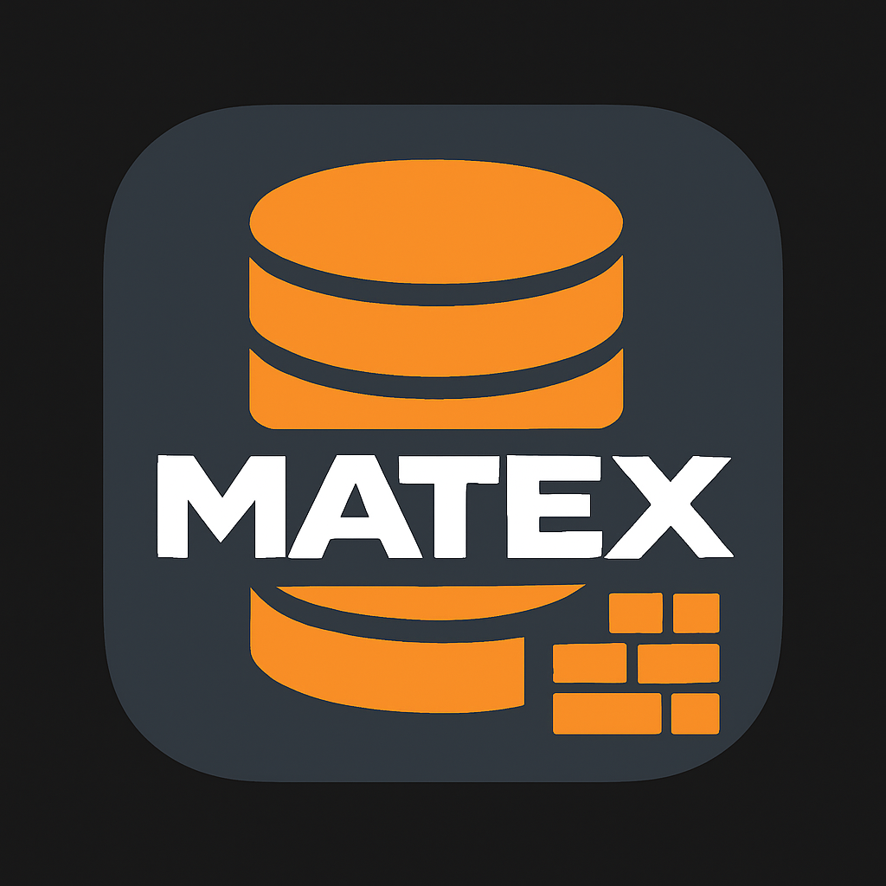
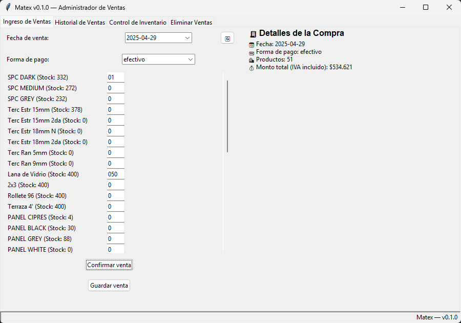
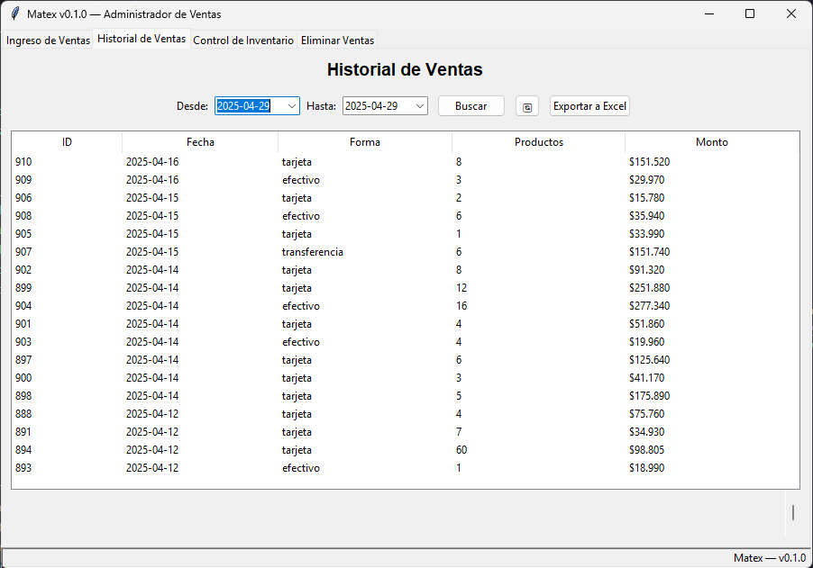
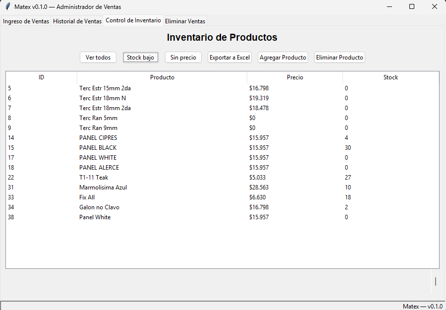

# Matex AdminDB



**Matex AdminDB** es una aplicación de escritorio escrita en **Python + Tkinter** que permite a Matex:

- Registrar ventas 💸 (múltiples formas de pago)
- Controlar inventario 📦 y precios
- Generar reportes a Excel 📊
- Restaurar stock al anular una venta
- Exportar historial de ventas y filtrarlo por fecha

> *Estado:* **Prototipo** — Fase de validación con el cliente  
> *Versión actual:* `v<0.1.0>` (semver)

---

## Demo rápida

| Pestaña | Descripción | Captura |
|---------|-------------|---------|
| **Ingreso de Ventas** | Agrega productos, aplica IVA (19 %) y confirma total antes de guardar. |  |
| **Historial** | Busca ventas por rango de fechas y exporta a Excel. |  |
| **Inventario** | Filtra por stock bajo o productos sin precio; CRUD completo. |  |

---

## Características clave


flowchart LR

- GUI[UI Tkinter]
- SERVICES[[Services<br>Producto / Ventas]]
- REPO[[Repositorios<br>SQL]]
- DB[(PostgreSQL)]
- GUI --> SERVICES
- SERVICES --> REPO
- REPO --> DB
- Type-hints + docstrings y pre-commit con Black, isort, flake8, mypy
- MkDocs + Material para esta documentación (CI/CD en GitHub Pages)

---

## Guía rápida
```bash
git clone https://github.com/Matic539/App-MatexDB.git
cd App-MatexDB
python -m venv venv       # crea entorno
source venv/bin/activate  # .\venv\Scripts\activate en Windows
pip install -r requirements.txt
cp .env.example .env      # ajusta credenciales PostgreSQL
python -m app.main        # ¡listo!
```

(Si necesitas más detalles, consulta la sección Instalación.)

---

## Créditos

Proyecto creado por Matías López • 2025
